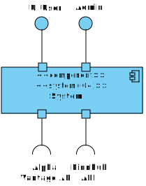
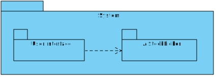
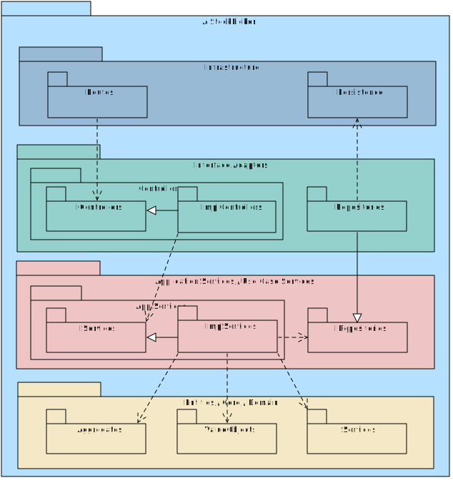
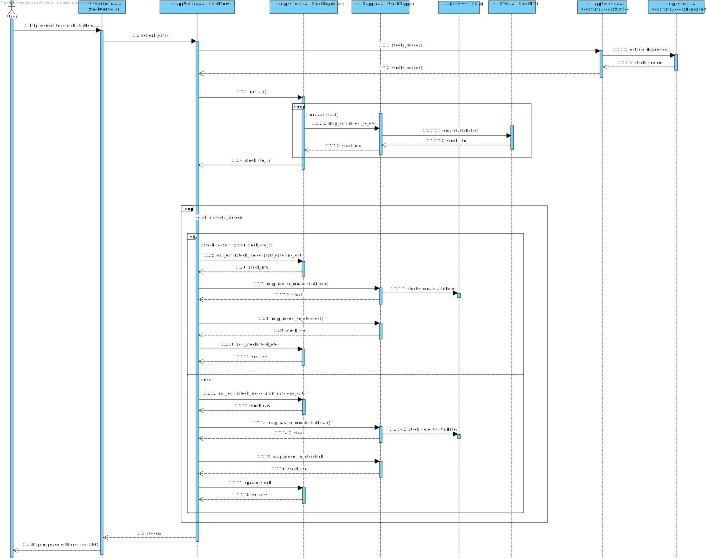

#### [Back](Home.md)

## Contents
- [Views](#views)
	- [Introduction](#introduction)
	- [Level 1](#level-1)
		- [Logical View](#logical-view)
		- [Processes View](#processes-view)
	- [Level 2](#level-2)
		- [Logical View](#logical-view-1)
		- [Implementation View](#implementation-view)
		- [Processes View](#processes-view-1)
		- [Physical View](#physical-view)
	- [Level 3](#level-3---aistockpicker)
		- [Logical View](#logical-view-2)
		- [Implementation View](#implementation-view-1)
		- [Processes View](#processes-view-2)
		- [Physical View](#physical-view-1)

# Views

## Introduction
A combination of two architectural representation models will be adopted: C4 and 4+1.

The 4+1 Views Model [[Krutchen-1995]](References.md#Kruchten-1995) proposes the description of the system through complementary views allowing to analyze separately the requirements of the various stakeholders of the software, such as users, system administrators, project managers, architects and developers. The views are thus defined as follows:

- Logical view: related to the aspects of the software aiming to respond to business challenges;
- Process view: concerning the flow of processes or interactions in the system;
- Development view: concerning the organization of the software in its development environment;
- Physical view: related to the mapping of the various components of the software onto hardware, i.e. where the software is executed;
- Scenario view: concerning the association of business processes with actors able to trigger them.

The C4 Model [[Brown-2020]](References.md#Brown-2020)[[C4-2020]](References.md#C4-2020) advocates describing software through four levels of abstraction: system, container, component and code. Each level adopts a finer granularity than the level preceding it, thus giving access to more detail of a smaller part of the system. These levels can be equated to maps, e.g. the system view corresponds to the globe, the container view corresponds to the map of each continent, the component view to the map of each country and the code view to the map of roads and neighborhoods of each city.
Different levels allow different stories to be told to different audiences.

The levels are defined as follows:
- Level 1: Description (framework) of the system as a whole;
- Level 2: Description of containers of the system;
- Level 3: Description of components of the containers;
- Level 4: Description of the code or smaller parts of the components (and as such will not be addressed in this DAS/SAD).

It can be said that these two models expand along different axes, with the C4 Model presenting the system with different levels of detail and the 4+1 View Model presenting the system from different perspectives. By combining the two models it becomes possible to represent the system from several perspectives, each with various levels of detail.

To visually model/represent both what has been implemented and the ideas and alternatives considered, the Unified Modeling Language (UML) is used. [[UML-2020]](References.md#UML-2020) [[UMLDiagrams-2020]](References.md#UMLDiagrams-2020).

## Level 1
### Logical View

## Level 2
### Logical View

### Implementation View

### Processes View
TBD

### Physical View

## Level 3 - AIStockPicker
### Logical View

### Implementation View

### Processes View

Sequence Diagram - Refresh Data Use Case

### Physical View
TBD